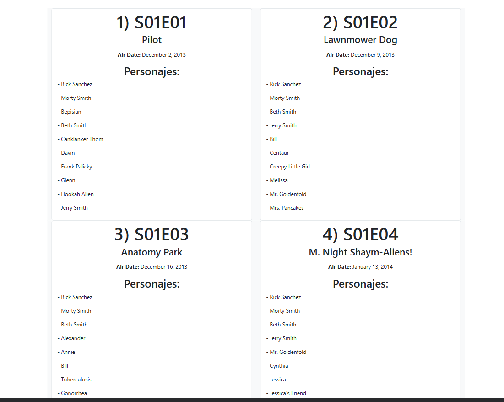

# Rick and Morty App 🚀

## Table of contents :page_facing_up:

- [Overview](#overview)
  - [Installation](#Installation)
  - [The challenge](#the-challenge)
  - [Screenshot](#screenshot)
- [My process](#my-process)
  - [Built with](#built-with)
  - [What I learned](#what-i-learned)
  - [Continued development](#continued-development)
  - [Useful resources](#useful-resources)
- [Author](#author)

## Overview :writing_hand:

this is a page where it shows us a list of the first 20 episodes of Rick & Morty where we see the first 10 characters that participated in the episode.
Link deploy : https://rick-morty-ten-kappa.vercel.app/

### Installation :gear:

To get started with the project, follow these steps:

1. Clone the repository:

```shell
git clone https://github.com/TatianaIng96/rick-morty.git
```

2. Navigate to the project directory:

```shell
cd rick-morty
```

3. Install the dependencies:

```shell
 npm install i
```

4. Start the application:

```shell
 npm run dev
```

The application will automatically open in your default web browser, ready for exploration.

### The Challenge :weight_lifting_man:

the challenge is to make requests in parallel to have the data of the episodes and characters and after this make a transformation
to obtain a page where it shows us the list of first 20 episodes of Rick & Morty where we see the first 10 characters that
participated in the episode, we just want to see the name and species of the character.

### Screenshot 📷

Here is a screenshot of the project's interface:

**_desktop view_**



**_mobile view_**


## My Process :mountain:

During this project, I gained valuable insights in the following areas:

- Setup: I created the project using Vite with the React template. Set up the basic file structure.
  \*Requests: I made requests in parallel using promiseAll
- Component Design: I designed the episode list, including its layout and functionality.
- Styling: I used bootstrap to design and create a visually appealing and responsive layout.
- Episode Management: I implemented the logic to request all the episodes and also bring me all the characters and thus be able to show the list of characters by episodes
- Tests: I verified that the data shown in the episode list is correct.

### Built With :hammer_and_wrench:

The project was built using the following technologies:

- React
- Boostrap
- JavaScript
- Vite

### What I Learned :microscope:

Through this project, I gained a deeper understanding of:

- Creation of a responsive and easy-to-use interface using React components.
  \*use requests in parallel to manage data from different APIs
- Manage and manipulate state in React using hooks.
- Using Bootstrap to improve the design process and maintainable CSS code.
- Work with Vite to streamline development workflow.

### Continued Development :briefcase:

While the current version of the app is functional, there are several areas that can be improved:

- Data persistence: Implementation of data persistence using a backend or in-browser storage for task persistence between sessions.
- Make improvements to the styles to make it look more visually appealing

### Useful Resources :sos:

During the development of this project, the following resources were helpful:

- Official React documentation: https://reactjs.org/docs
- Official Sass documentation: https://react-bootstrap.github.io/

## Author :nerd_face:

This project created by erickfabiandev.

- Leidy Tatiana Cardona
